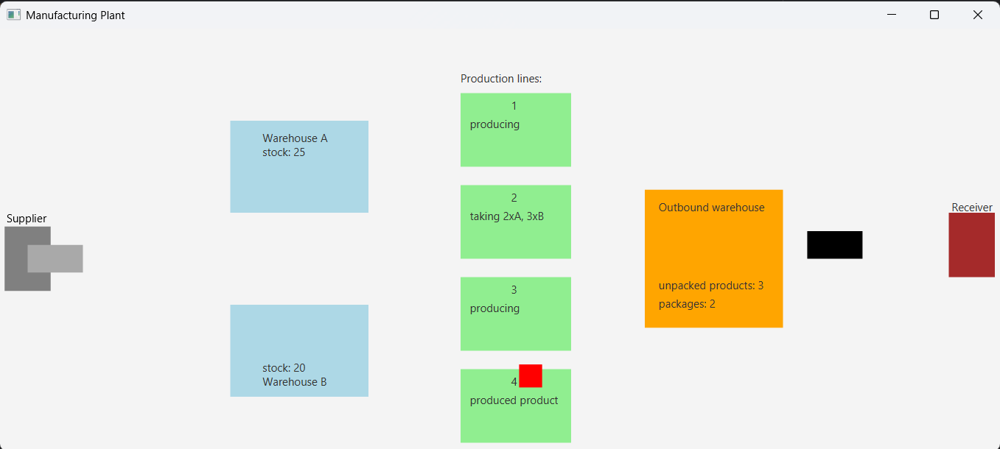

# Production Plant Simulation in Java

## Project Description

This project simulates a production plant using Java and JavaFX, focusing on concurrency control and thread synchronization mechanisms.

### Scenario

The production plant manufactures products of the same type across multiple production lines using two types of raw materials. These raw materials are stored in separate warehouses, each exclusively supplied by a single delivery truck. Materials are restocked when warehouse stock drops below a defined threshold. Product manufacturing on a line takes a random amount of time. Finished products are transferred from the production line to the outbound warehouse, from which they are picked up at random intervals in the form of packages (each containing a fixed number of items).

### Application GUI

### How to Run

1. Open the project in your preferred Java IDE.
2. Make sure JavaFX is properly configured.
3. Run the `Main` class to start the application.
4. The GUI will launch and display the activity of the production plant in real time.